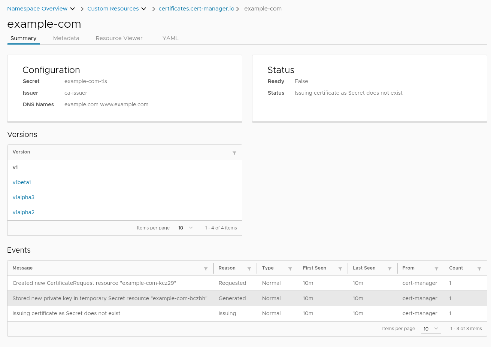

# Octant cert-manager Plugin

An Octant plugin for [cert-manager](https://cert-manager.io/) used to demo plugin functionality.

This plugin shows the DNS names for a given certificate.



## Requirements

- Octant 0.19.0+
- Currently supports `cert-manager.io/v1`

## Installation

Go 1.16+ is required. 

```
make install
```

This will compile the plugin and automatically move the binary to Octant's plugin path.

